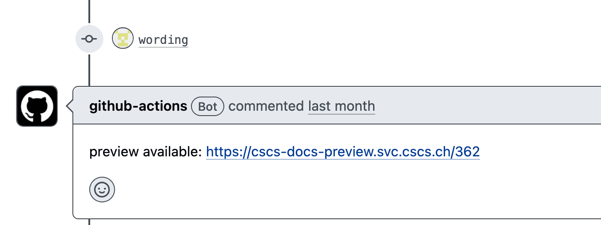

## User Documentation at CSCS

Ben Cumming

eth-cscs.github.io/pead26

PEAD at CuG 2026

---
layout: two-cols-header
layoutClass: gap-2
---

# It all started 18 months ago...

18 months ago CSCS had objectively bad documentation.

::left::

**
What
**

- We used a content managent system (CMS)
    * Confluence `<opinion>` ☠️❗💣💩  `</opinion>` 
- There was one person responsible for the docs
    * Role was to politely ask groups for submissions

::right::

**
How
**

- Low coverage of key topics
- Out of date information
- Varying visual and writing style
- Staff were frustrated
    * `<opinion>`fixing it felt "too big"`</opinion>`

 
 
 
 

---

# Confluence challenges

Confluence was **path of least resistance** after CSCS adopted Atlasian for internal use.
* WYSIWYG editor is preferred by non-technical staff
* Docs are written by technical staff who wouldn't choose Confluence

Separate [Production](https://confluence.cscs.ch/spaces/KB/overview) and [TDS](https://confluence.cscs.ch/spaces/KBTDS/overview) instances.
* change management was manual and error prone: copy pages from TDS to Production.
* broken links everywhere (copying from TDS to Prod required updating links)
* reviewing of contributions was unstructured
* no clean history of changes

Also, Confluence search
* if you know, you know

---

# Process

* Individual teams fully responsible for their documentation:
    * islands of documentation;
    * teams would reproduce other docs in their section instead of linking and updating other areas.
    * different "styles" and philosophies about what should be in the docs;

* We started to optimize around Confluence search
    * One FAQ question per page -> more likely to show up in search

---

# The change

1. A small group of engineers tried to fix the styling and content:
    * the TDS was now completely out of sync with production
    * they work stalled
2. I created a small [mock up](https://bcumming.github.io/kb-poc/) vertical slice using [Material for MkDocs](https://squidfunk.github.io/mkdocs-material/)
    * **one hour** to style it and set up CI/CD for build and deploy to GitHub Pages
    * **one day** to copy and update the content
3. Very positive reaction from engineers
    * a self-appointed **benevolent committee for documentation** was formed
    * **two months part time** for me to port all existing docs
4. Little push-back
    * `<opinion>`speak up tool loudly and you might own the docs`</opinion>`

---

# The docs

`<opinion>`CSCS user docs are now quite good`</opinion>`

[Live demo](https://docs.cscs.ch) at `docs.cscs.ch`

 
 

    

---

# Benefits of GitHub + Material for MkDocs

Docs as code lets engineers use familiar tools:
- git, vim/emacs/vs-code, GitHub workflow
- clear history: multi-page edits are encapsulated in a PR
- CI/CD checks links and spelling, and handles deployment

Markdown is not rich and MkDocs is simple to deploy
- focus on the content and just accept the styling
    - _except tables_: many contributors use html tables
- engineers own the deployment process

Static docs are fast to load and deploy
* and they don't go down for maintenance

---

# New philosophy

- Everybody can contribute to any part of the docs
    - Request review from docs owners---core team reviews and merges if no timely response
- Harmonised docs require **some level of central coordination**
    - Core team rewrites and refactors contributions
        - easier than asking busy engineers to do this on top of writing
    - Take the time to discuss contributions beforehand

Not everybody was pleased with the change
- A handful of engineers liked WYSIWYG
- A handful of engineers don't like guidelines

---

# Topics for discussion

- The future of Material for MkDocs
    - it took 5 minutes to adapt to Zensical
- We are getting more contributions written by AI Agents
    - They ignore our style guide (just like humans!)
- We get small fixes from our community---but nothing significant
- Contributions from non-technical people
    - User facing docs are >95% technical in our case
- FAQs are lazy writing, amiright?

