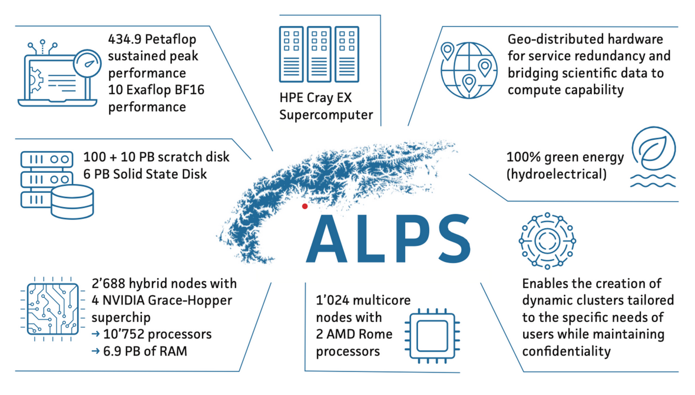
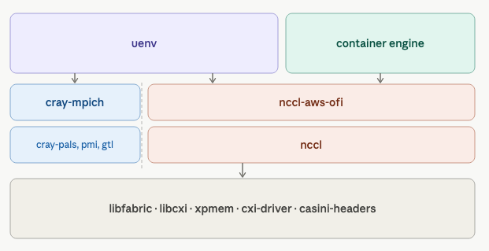

## Software Environments at CSCS

Ben Cumming

eth-cscs.github.io/pead26

PEAD at CuG 2026

---
layout: two-cols
layoutClass: gap-2
---

# Alps

* CSCS deploys **vCluster**s on a single HPE Cray EX system **Alps**
    - 6 node types
    - over 10 prod. use-case specific clusters
* CSCS' approach reflects the reality that providing bespoke environments on top of CPE does not scale to `N+1` systems.

 

CSCS does not provide CPE directly installed on our systems

* CPE is deprecated on one remaining system

::right::

 
 
 

    

---
layout: two-cols-header
layoutClass: gap-2
---

# Containers and uenv

::left::

## uenv

* Use Spack to build self-contained environments
    * cray-mpich is repackaged as a Spack package
    * libfabric is built or pulled from system
* Each env is a SquashFS file stored in a registry
* Lightweight CLI runner and SLURM plugin mount the SquashFS and set environment variables

::right::

## containers

* Use Podman to build containers
* Convert containers to SquashFS images
* SLURM plugin mounts and chroots
* Hooks extend containers with native network support, NCCL-aws-ofi plugin, GPUs (NVIDIA and AMD), etc. into running containers.

---

# CPE Components Used

    

Observation: Conway's law dictates that `libfabric` and `libcxi` being developed outside of the CPE team matterst to sites.

---

# How HPE can make CSCS happy

Open source cray-mpich and its dependencies:

* it is getting harder to support the matrix of `aarch64`x`x86_64`, `NVIDIA`x`AMD`x`CPU only`, `SP5`x`SP6`x`SP7` versions
* Observation: the open source software is developed outside CPE

Commit to flexible deployment of packages

* we lost access to the the "experimental" RPM repository for a few weeks with no explanation

Take ownership of first class support for NVSHMEM, etc.

Support up to date GPU drivers

* Conway's law says it _is_ your responsibility

---

# What to avoid
